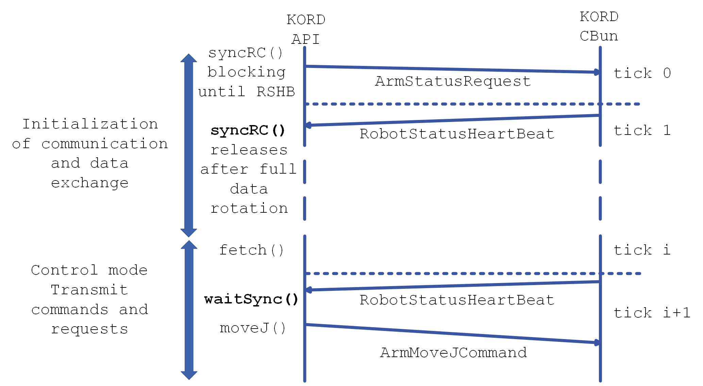
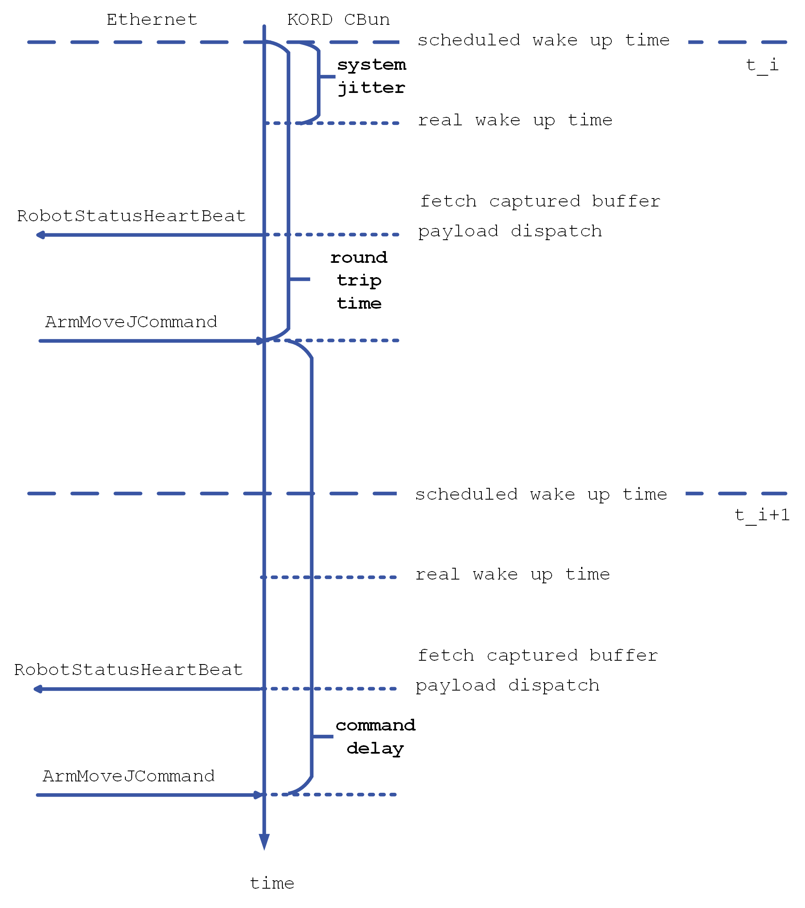
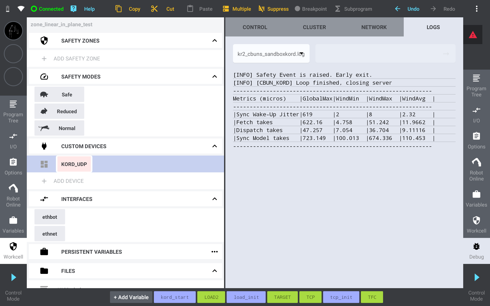
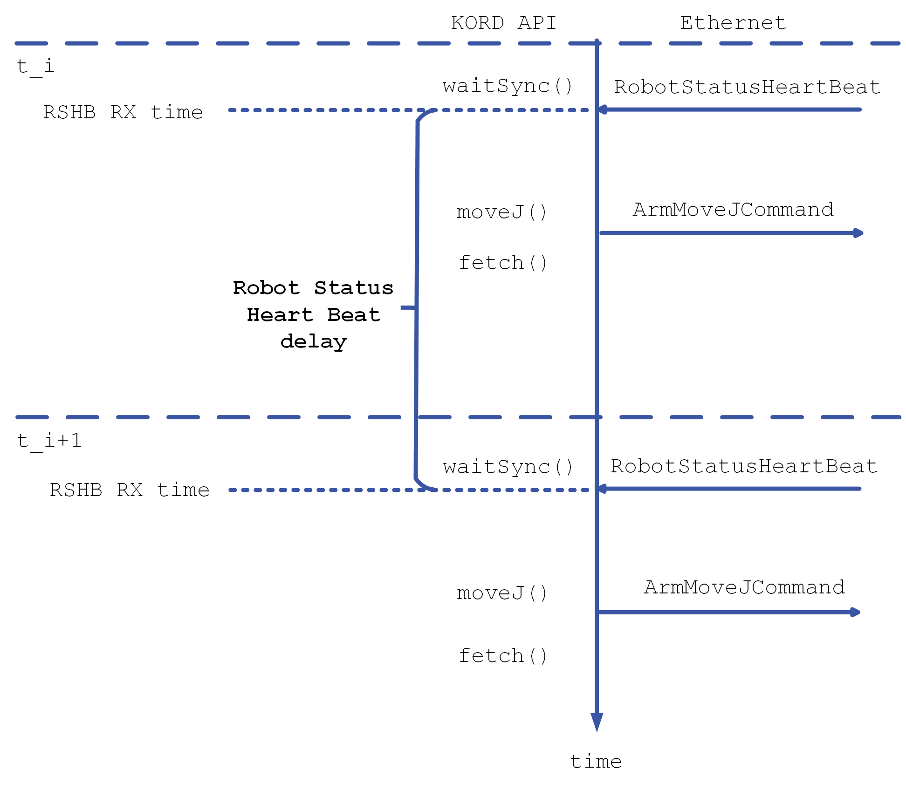
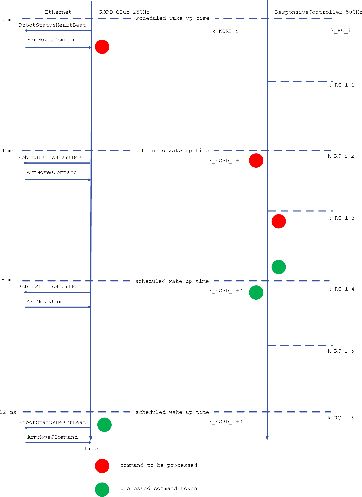

.. _statistics:

**********
Statistics
**********

.. |br| raw:: html

    

The KORD system provides monitoring metrics for communication quality. These
metrics are computed both on the controller side (**KORD CBun**) and on the
client side (**KORD API**). They help detect and diagnose issues such as
lost frames, jitter, and round-trip delays.

While these statistics can be monitored continuously, they are especially
relevant during joint and linear movement commands, which are sent at a
rate of 250 Hz (every 4 ms). Any unexpected deviations in arrival times,
round-trip times, or jitter could indicate network or performance problems.

CBun Statistics
===============

On the **controller side**, the CBun collects statistics about how well it is
receiving and processing commands. These data are transferred back to the KORD API
and can be queried via :cpp:func:`kr2::kord::ReceiverInterface::getStatistics`.

.. list-table:: **Table 1: Statistics Calculated at the CBun and Transferred via Robot Status Heart Beat**
   :widths: 50 65
   :header-rows: 1

   * - Enum Member
     - Description
   * - **CMD_JITTER_MAX_LOCAL**
     - Maximum deviation (microseconds) in command synchronicity within a given |br|
       statistics window.
   * - **CMD_JITTER_AVG_LOCAL**
     - Average deviation (microseconds) in command synchronicity within a given |br|
       statistics window.
   * - **CMD_JITTER_MAX_GLOBAL**
     - Maximum deviation (microseconds) in command synchronicity across the |br|
       entire runtime.
   * - **ROUND_TRIP_TIME_MAX_LOCAL**
     - Maximum command round-trip time (microseconds) within a given |br|
       statistics window.
   * - **ROUND_TRIP_TIME_AVG_LOCAL**
     - Average command round-trip time (microseconds) within a given |br|
       statistics window.
   * - **ROUND_TRIP_TIME_MAX_GLOBAL**
     - Maximum command round-trip time (microseconds) across the |br|
       entire runtime.
   * - **CMD_LOST_COUNTER_LOCAL**
     - Number of commands lost in the current window, based on sequence numbers.
   * - **CMD_LOST_COUNTER_GLOBAL**
     - Total number of commands lost across the entire runtime, based on sequence numbers.
   * - **SYS_JITTER_MAX_LOCAL**
     - Maximum deviation (microseconds) of the controller’s control-thread |br|
       wake-up time from the scheduled time within the current window.
   * - **SYS_JITTER_AVG_LOCAL**
     - Average deviation (microseconds) of the controller’s control-thread |br|
       wake-up time from the scheduled time within the current window.
   * - **SYS_JITTER_MAX_GLOBAL**
     - Maximum control-thread wake-up deviation (microseconds) across the |br|
       entire runtime.

.. _api-statistics:

API Statistics
==============

On the **client side**, the KORD API also gathers statistics about incoming
Robot Status Heart Beat (RSHB) frames. You can retrieve these data via
:cpp:func:`kr2::kord::KordCore::getAPIStatistics` to assess the connection’s
quality from the API perspective.

.. list-table:: **Table 2: Statistics Calculated Locally by the KORD API**
   :widths: 50 65
   :header-rows: 1

   * - Enum Member
     - Description
   * - **RSHB_JITTER_MAX_LOCAL**
     - Maximum jitter of the RSHB frames (within a specified window) |br|
       based on the KORD API’s receive timestamps.
   * - **RSHB_JITTER_MIN_LOCAL**
     - Minimum jitter of the RSHB frames (within a specified window) |br|
       based on the KORD API’s receive timestamps.
   * - **RSHB_JITTER_AVG_LOCAL**
     - Average jitter of the RSHB frames (within a specified window) |br|
       based on the KORD API’s receive timestamps.
   * - **RSHB_JITTER_AVG_GLOBAL**
     - Average jitter of the RSHB frames over the entire runtime, |br|
       based on the KORD API’s receive timestamps.
   * - **RSHB_JITTER_MAX_GLOBAL**
     - Maximum jitter of the RSHB frames over the entire runtime, |br|
       based on the KORD API’s receive timestamps.
   * - **RSHB_CONS_LOST_COUNTER_MAX_LOCAL**
     - Maximum number of consecutive RSHB frames lost (within a |br|
       specified window), based on sequence numbers.
   * - **RSHB_CONS_LOST_COUNTER_AVG_LOCAL**
     - Average number of consecutive RSHB frames lost (within a |br|
       specified window), based on sequence numbers.
   * - **RSHB_CONS_LOST_COUNTER_MAX_GLOBAL**
     - Maximum number of consecutive RSHB frames lost over total runtime, |br|
       based on sequence numbers.
   * - **RSHB_LOST_COUNTER_LOCAL**
     - Total number of RSHB frames lost within the current window, |br|
       based on sequence numbers.

Communication Schemas
=====================

The statistics above rely on timestamps and periodic events in both the
KORD API and the CBun. This section illustrates how communication is initiated
and how the data flow supports these calculations.

Start of Communication
----------------------

   **Figure 1**: Communication start procedure (initiation of the communication).

1. The KORD API initiates communication with the CBun by calling :cpp:func:`syncRC <kr2::kord::KordCore::syncRC>`.
2. Once synchronization is established, the CBun starts sending Robot Status
   Heart Beat messages (RSHB).
3. After :cpp:func:`syncRC <kr2::kord::KordCore::syncRC>`, subsequent commands should be sent only after :cpp:func:`waitSync <kr2::kord::KordCore::waitSync>`
   has released. This ensures commands are synchronized at 250 Hz (every 4 ms).

When a continuous stream of movement commands is provided at the expected rate,
the CBun and the KORD API can accurately calculate and update the statistics in real time.

Local and Global Statistics
---------------------------

Some metrics (e.g., jitter, round-trip time, lost frames) are calculated
over a **sliding window** to capture recent behavior (referred to as “local”
or “within a given window”). There are also “global” values that track
maximum or total counts for the entire runtime, useful for analyzing overall
performance.

.. math::
   d = T[i] - T[i-1]

**Legend:**

- :math:`d`: Delay between consecutive frames.
- :math:`T[i]`: Capture time of the current frame (or command).
- :math:`T[i-1]`: Capture time of the previous frame (or command).

KORD CBun
---------

The CBun calculates command-reception timestamps and compares them to the
expected 4 ms period. It also tracks round-trip times for commands.

   **Figure 2**: Time stamps and statistics calculated on the CBun side.

**Command Jitter**

.. math::
   J_{\text{CMD}} = d - T_{\text{KORD}}

- :math:`J_{\text{CMD}}`: Jitter of the incoming commands.
- :math:`d`: Delay between consecutive commands.
- :math:`T_{\text{KORD}}`: Expected update period (4 ms).

**Round Trip Time**

.. math::
   t_{\text{RT}} = T_{\text{CMD_RX}}[i] - T_{\text{TICK}}[i]

- :math:`t_{\text{RT}}`: Estimated round-trip time for the command.
- :math:`T_{\text{CMD_RX}}[i]`: Timestamp when the command is received.
- :math:`T_{\text{TICK}}[i]`: Start time of the corresponding controller tick.

Tests show typical network travel time over a short Ethernet link is ~80 µs,
but the overall round-trip time includes additional processing delays at both
the CBun and the controller.

   **Figure 3**: Example of statistics displayed on the tablet interface.

KORD API
--------

On the API side, statistics primarily revolve around reception of the RSHB:
calculating jitter, frame loss, and consecutive lost frames. If a frame is not
received before the next expected interval, a missed-frame count is incremented.

   **Figure 4**: Timestamps captured on the KORD API side.

By default, the API’s control loop is triggered by receiving an RSHB or by
a timeout in :cpp:func:`kr2::kord::KordCore::waitSync`. If frames arrive late, the calculated jitter increases accordingly.

KORD Round Trip Time
--------------------

Theoretically, the entire round-trip time (command + token confirmation) can be
as low as 12 ms under ideal conditions. In practice, additional delays (internal
buffering, CBun loops) often raise it to around 16 ms. Future optimizations may
reduce this.

   **Figure 5**: Theoretical ideal round-trip of a command and its token.

Used Internally (Debugging)
===========================

Some statistics are meant for internal debugging and are not generally relevant
for standard operation. Their usage is discouraged unless you have a specific
troubleshooting need.

.. list-table:: **Table 3: Debug Statistics**
   :widths: 20 30 50
   :header-rows: 1

   * - Source
     - Enum Member
     - Description
   * - **CBun**
     - FAIL_TO_READ_EMPTY
     - Number of times ``recvfrom()`` returned 0, indicating an empty read.
   * - **CBun**
     - FAIL_TO_READ_ERROR
     - Number of times ``recvfrom()`` returned an error.
   * - **KORD API**
     - MAX_RX_GLOBAL
     - Maximum global difference in the API’s receive times.
   * - **KORD API**
     - MIN_RX_GLOBAL
     - Minimum global difference in the API’s receive times.
   * - **KORD API**
     - AVG_RX_GLOBAL
     - Average global difference in the API’s receive times.
   * - **KORD API**
     - RSHB_LOST_COUNTER_GLOBAL
     - Total number of lost RSHB frames over the entire runtime.
   * - **KORD API**
     - FAILED_RCV
     - Counter tracking how many times ``recvfrom()`` returned an error.

When debugging, you can print these and other statistics using the helper
function :cpp:func:`kr2::kord::KordCore::printStats`. An example output:

+----------------------------------+---------------+---------------+---------------+
| **Metrics**                      | **GlobalMax** | **GlobalAvg** | **GlobalMin** |
+==================================+===============+===============+===============+
| Command Jitter (ms)              | 0.618         |               |               |
+----------------------------------+---------------+---------------+---------------+
| Round Trip Time (RTT) (ms)       | 1.834         |               |               |
+----------------------------------+---------------+---------------+---------------+
| System Jitter (ms)               | 0.619         |               |               |
+----------------------------------+---------------+---------------+---------------+
| API’s Timestamps Delay (ms)      | 12.1298       | 3.99994       | 3.19517       |
+----------------------------------+---------------+---------------+---------------+
| CBun’s Timestamps Delay (ms)     | 4.69851       | 3.99993       | 3.33362       |
+----------------------------------+---------------+---------------+---------------+
| API’s Timestamps Jitter (ms)     | 11.4513       | 0.021165      |               |
+----------------------------------+---------------+---------------+---------------+
